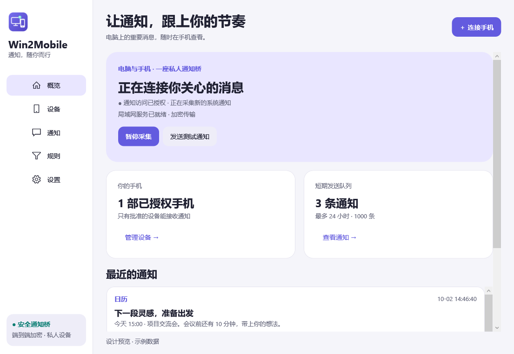
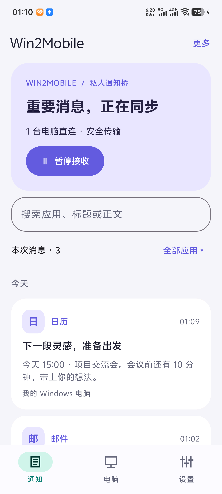

<div align="center">
  
  <h1>Win2Mobile</h1>
  <p><strong>通知，随你而行。</strong></p>
  <p>把 Windows 系统通知，安全地送到你的 Android 手机。</p>
  <p>
    <a href="https://github.com/wang329856/Win2Mobile-NotifyBridge/releases"></a>
    <a href="https://github.com/wang329856/Win2Mobile-NotifyBridge/actions/workflows/build.yml"></a>
    <a href="LICENSE"></a>
    
  </p>
  <p>
    <a href="#下载安装">下载安装</a> ·
    <a href="docs/installation.md">安装教程</a> ·
    <a href="docs/relay.md">跨网与自建服务</a> ·
    <a href="PRIVACY.md">隐私说明</a> ·
    <a href="CHANGELOG.md">更新日志</a> ·
    <a href="https://github.com/wang329856/Win2Mobile-NotifyBridge/issues/new/choose">问题反馈</a>
  </p>
</div>

---

Win2Mobile 是一个开源的 Windows → Android 通知桥。电脑上的系统 Toast 通知经授权后转发到手机，适合离开桌面时查看消息、邮件与日程提醒。桌面端使用 C# / .NET / WPF，手机端使用 Kotlin / Jetpack Compose。

**同一局域网内直接连接，不依赖公共中转，也不需要互联网。跨网功能需主动开启，默认使用第三方 `ntfy.sh`，受其服务可用性、网络可达性与限额影响；也可配置兼容的自建 ntfy 服务。**

## 功能亮点

| 功能 | 使用体验 |
| --- | --- |
| 局域网直连 | HTTPS / WSS 传输，扫码绑定电脑证书指纹，无需公共服务器 |
| 加密跨网 | 每部手机独立 topic 与 AES-256-GCM 密钥，通知在电脑加密、手机解密 |
| 明确授权 | 二维码 120 秒有效，电脑批准后才能接收；远程配对核对六位校验码 |
| 自动选择通道 | 优先检查已保存的可信局域网地址，不可达时使用已授权中转，也可指定连接模式 |
| 随时暂停与继续 | 手机保留本次消息与接收进度，恢复后补收仍在电脑队列中的内容 |
| 消息管理 | 搜索与应用筛选、滑动删除与短时撤销、通知栏显示来源应用；3.1.2 同步撤回已删除消息的系统通知 |
| 桌面常驻 | 系统托盘、来源过滤、设备撤销及可选登录启动 |
| 两端统一界面 | 浅色 / 深色主题、统一品牌图标与竖屏扫码界面 |

## 界面预览

<table>
  <tr>
    <th width="72%">Windows · 概览</th>
    <th width="28%">Android · 本次消息</th>
  </tr>
  <tr>
    <td valign="top"></td>
    <td valign="top"></td>
  </tr>
</table>

截图使用示例数据，Windows 图为设计预览。更多深色主题、配对与设置页面见 [界面改版记录](docs/ui-redesign-2026-10-02.md)。截图和构建通过不代表所有手机的后台接收均已验证。

## 下载安装

当前正式版为 **[v3.1.2](https://github.com/wang329856/Win2Mobile-NotifyBridge/releases/tag/v3.1.2)**。请从 GitHub Release 下载安装附件；页面自动生成的 **Source code** 是源码。

| 平台 | 下载 | 要求与说明 |
| --- | --- | --- |
| Windows | **[安装套件 ZIP](https://github.com/wang329856/Win2Mobile-NotifyBridge/releases/download/v3.1.2/Win2Mobile-Setup-x64.zip)** | x64；Windows 10 build 19041 或更新；含 MSIX、公钥证书与安装说明，自带 .NET 运行时 |
| Windows | [独立 MSIX](https://github.com/wang329856/Win2Mobile-NotifyBridge/releases/download/v3.1.2/Win2Mobile-Setup-x64.msix) | 适合已核验并信任发布证书的电脑 |
| Android | **[正式 APK](https://github.com/wang329856/Win2Mobile-NotifyBridge/releases/download/v3.1.2/Win2Mobile-3.1.2-release.apk)** | Android 8.0（API 26）或更新；使用独立 release 签名 |
| 文件校验 | [SHA256SUMS.txt](https://github.com/wang329856/Win2Mobile-NotifyBridge/releases/download/v3.1.2/SHA256SUMS.txt) | 下载后核对 SHA-256 |

Windows 使用自签名证书，首次安装须核验并信任证书；当前包已加入可信时间戳。Android 正式包无法直接覆盖签名不同的旧 debug APK。具体步骤见 **[安装与升级教程](docs/installation.md)**，签名与实机验证范围见 [3.1.2 发布记录](docs/releases/v3.1.2.md)。

## 快速上手

1. **安装两端**：Windows 安装 MSIX 后从开始菜单打开 Win2Mobile；手机安装正式 APK。
2. **授权电脑**：点击「授权通知访问」，允许 Windows 系统提示。手机按需允许通知与扫码相机权限。
3. **扫码配对**：两端连接可互通的局域网；打开电脑「连接手机」，用手机「扫码连接电脑」扫描二维码。
4. **批准设备**：在电脑核对设备名称并批准请求。
5. **验证接收**：电脑点击「发送测试通知」，确认手机收到，再验证来自应用的新系统通知。

局域网需要电脑私人网络允许 **TCP 47721** 入站；访客 Wi-Fi、AP 隔离或 VPN 可能阻断互访。应用不会自动修改防火墙。离开局域网前，请按 [跨网教程](docs/relay.md) 开启中转并完成授权。

## 连接方式与服务依赖

| 方式 | 数据路径 | 外部服务依赖 |
| --- | --- | --- |
| 仅局域网 | Windows → HTTPS / WSS → Android | 无公共中转依赖，两端需互相可达 |
| 默认跨网 | Windows → 加密密文 → `ntfy.sh` → Android 解密 | 依赖第三方服务、互联网、额度与缓存策略；跨网开关默认关闭 |
| 自建跨网 | Windows → 加密密文 → 自建 ntfy → Android 解密 | 依赖自己的服务与网络；需兼容 HTTPS、WSS 和匿名 topic |
| 自动 | 手机优先尝试可信 LAN，失败后使用已授权中转 | 能否回退取决于是否已启用跨网并取得中转凭据 |

公共服务的故障、限流或网络不可达可能延迟或中断跨网通知。长通知按加密分片发送，每部手机、每个分片及重试都会消耗额度；缓存过期后也可能出现消息缺口。具体限制以 [ntfy 官方说明](https://docs.ntfy.sh/publish/#limitations) 为准。

公共中转不持有通知解密密钥，但可见 IP、topic、事件 ID、消息大小和时间等元数据。**「中转已连接」不代表电脑在线或手机已经保存消息。** 自建入口及当前不支持的账号鉴权方式见 [跨网与自建服务](docs/relay.md)；数据处理和删除边界见 [隐私说明](PRIVACY.md)。

## 使用边界

- **采集范围**：仅进入 Windows 通知平台的 Toast；应用自绘弹窗、聊天记录和远程操作不在范围内。Windows 需 MSIX 包身份和通知权限，直接运行 EXE 无法完成系统通知采集。
- **保留与补收**：没有已授权手机时不将通知采集入库；电脑短期队列最多保留 24 小时 / 1000 条，按先达到的上限清理。手机列表没有相同的自动过期策略，可自行删除、清空或开始新一轮接收。
- **暂停语义**：电脑暂停采集期间产生的通知不会补发；手机暂停保留进度，继续时只补收本次会话且仍在电脑队列中的消息。新一轮接收会清空手机列表、重建基线。
- **后台接收**：Android 使用原生前台服务，Doze 与厂商后台限制仍可能影响联网；公共中转或息屏时不保证必达。跨网也要求电脑持续运行并启用中转。
- **停止跨网**：手机选择「仅局域网」或暂停接收不会停止电脑发布；请关闭电脑的跨网开关，或撤销对应设备。已经进入中转缓存的旧密文无法追回。
- **平台支持**：目前提供 Windows x64 与 Android 安装包；不提供 iOS 或 Windows ARM64 原生包。

## 文档与开发

| 需要了解 | 入口 |
| --- | --- |
| 安装、升级与常见故障 | [安装教程](docs/installation.md) |
| 跨网、服务限额与自建入口 | [中转教程](docs/relay.md) |
| 数据、权限与删除说明 | [PRIVACY.md](PRIVACY.md) |
| 版本变化与下载记录 | [CHANGELOG.md](CHANGELOG.md) |
| 源码构建、签名与测试 | [开发指南](docs/development.md) · [Windows 打包](packaging/windows/README.md) |
| 传输与配对协议 | [局域网 v1](docs/protocol-v1.md) · [ntfy v1](docs/protocol-ntfy-v1.md) |
| 真实设备验证范围 | [双设备验收](docs/device-validation.md) · [跨网验收](docs/ntfy-device-validation.md) |

```text
src/
  Bridge.Core/           SQLite 队列、设备与事件模型
  Bridge.Transport.Lan/  TLS、配对、认证与局域网事件流
  Bridge.Transport.Ntfy/ 加密分片、中转发布与远程配对
  Bridge.Windows/        WPF、系统托盘与官方通知监听
  android/               Kotlin、Compose、Room 与前台接收服务
tests/                   集成、桌面状态与中转测试
packaging/windows/       MSIX 清单、资源与安装脚本
scripts/                 构建、测试与打包入口
docs/                    教程、协议、发布与验收记录
```

## 反馈与贡献

遇到问题，请先查看 [常见故障](docs/installation.md#常见问题)，再通过 [问题反馈模板](https://github.com/wang329856/Win2Mobile-NotifyBridge/issues/new/choose) 提供两端版本、连接模式、复现步骤和预期结果。提交截图前请遮盖通知正文、二维码、topic 与凭据。

欢迎改进文档、修复缺陷或提交功能建议。开发环境与验证命令见 [开发指南](docs/development.md)；贡献流程见 [CONTRIBUTING.md](CONTRIBUTING.md)。

## 许可证

本项目使用 **[MIT License](LICENSE)**。允许使用、修改与分发，需保留版权和许可证声明；第三方依赖遵循各自许可证。
