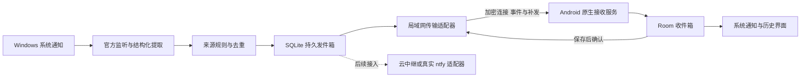

# Win2Mobile-NotifyBridge 技术路线评估与重构建议

日期：2026-09-30。评估基线：本地分支 `1.1.0dev`，提交 `253534b2c376fa80279726e72768d1cdfc26abe4`。已查看项目 GitHub 页面；以下代码结论以本地这个版本为准。

用户已明确：仅支持 Android；最主要的问题是安装配置复杂、界面和整体体验差；先保证同一局域网可用，之后可拓展跨网络。

## 建议与选择依据

建议保留 C# 与 Windows 官方通知监听 API，重新实现安装、授权、配对、可靠传输和 Android 后台接收。局域网默认由 Windows 程序内置服务器；手机无需填写 IP、端口和 topic，也无需另装通知服务器。

针对当前小规模代码和仅 Android 的目标，推荐手机端用 Kotlin + Jetpack Compose 重写。理由是后台服务、设备关联、系统通知、网络变化与权限引导是这个产品的核心，原生实现可以少维护一层 Flutter 与 Android 之间的桥接。Compose 是 Android 官方推荐的原生 UI 工具。[Android Compose 文档](https://developer.android.com/compose)

这是针对本项目的工程取舍，并不能据此断定 Flutter 导致了现有问题。若你更熟悉 Flutter，也可以保留 Flutter UI，将接收服务、持久化和系统通知放到 Kotlin 模块中；仍需完成相同的后台链路。Flutter 官方支持后台执行机制，但现有项目并未实现它们。[Flutter 后台执行文档](https://docs.flutter.dev/packages-and-plugins/background-processes)

| 部分 | 推荐选择 | 决策理由 |
| --- | --- | --- |
| Windows 核心 | C# + .NET 10 LTS | 直接调用 Windows API，复用已有知识；当前 .NET 6 已停止支持 |
| Windows UI | WPF，托盘常驻，MVVM | 足以实现向导、设备管理和诊断；UI 框架不决定捕获可靠性 |
| 捕获 | UserNotificationListener + 包身份 + UI 线程授权 | 用平台通知数据作为主来源 |
| 局域网通信 | 内置 ASP.NET Core Kestrel；HTTPS + WebSocket | 一套程序包含通信能力，采用维护完善的服务器实现 |
| 配对 | 二维码 + 电脑确认 + 持久设备凭据 | 将地址、信任信息和协议版本交给程序管理 |
| 发现 | mDNS/Android NSD 辅助，二维码作为入口 | 应对 IP 变化，发现失败时仍有明确操作路径 |
| 消息可靠性 | Windows SQLite 发件箱；Android Room 收件箱 | 支持补发、幂等和历史记录 |
| Android | Kotlin + Compose + 原生接收服务 + NotificationManager | UI 与接收生命周期分离 |
| 后续跨网络 | 独立传输适配器，可接真正的 ntfy 或中继 | 保持采集、规则和界面不依赖具体传输方式 |

截至评估日期，.NET 10 是受支持的 LTS 版本，.NET 6 已在 2024 年 11 月结束支持。[.NET 官方支持策略](https://dotnet.microsoft.com/en-us/platform/support/policy/dotnet-core)

Kestrel 是 ASP.NET Core 的服务器，可嵌入桌面进程；采用它能省去 HttpListener 的 URL ACL 配置，但局域网访问仍需要正确处理 Windows 防火墙。[Kestrel 官方文档](https://learn.microsoft.com/en-us/aspnet/core/fundamentals/servers/kestrel?view=aspnetcore-10.0)

## 现状：问题来自哪些环节

现有链路：Windows 通知列表轮询或窗口文本抓取 → 自写 HttpListener 服务器 → 手机页面中的 Dart 定时轮询 → 本地通知插件。

### 1. 安装和首次使用没有形成完整流程

- README 要求用户理解 IP、端口、topic、防火墙、URL ACL、MSIX 或 sparse package。
- `scripts/build_service.ps1` 仍输出安装为 Windows Service 的指令，和当前用户会话托盘架构冲突。程序也没有实现 Windows Service 的服务入口。
- sparse package 脚本不具备官方示例中的完整外部位置身份配置流程；它创建了证书，却没有完成受信签名安装链路。
- `MainForm.cs` 展示的是固定状态文本，没有授权引导、设备配对、连接诊断和持久设备管理。
- `SaveSettings()` 写到程序安装目录；正式安装或打包之后，这个目录可能不可写。新配置应存入用户 AppData。

Windows 包身份需要安装流程和进程身份一起处理，不能仅复制清单就认为可用。现有清单没有 sparse package 的 `AllowExternalContent` 声明，注册调用也没有设置外部位置。官方流程还包括可执行文件身份元数据与安装器注册。[Microsoft 外部位置打包文档](https://learn.microsoft.com/en-us/windows/apps/desktop/modernize/grant-identity-to-nonpackaged-apps)

### 2. Windows 官方采集路径存在具体实现错误

证据位置：`src/NotificationService/Services/NotificationCaptureService.cs` 第 39–70 行；`Package.appxmanifest` 第 48 行；`scripts/package_msix.ps1` 的清单模板。

- `RequestAccessAsync()` 在新建后台线程调用。设置 STA 不等于在应用 UI 线程调用。官方文档要求从 UI 线程请求授权。
- 清单使用 `rescap:Capability Name="userNotificationListener"`，应按官方 schema 使用 `uap3:Capability`。
- 第一次轮询会把通知中心已有项目全部当作新消息，没有明确的首次启动同步策略。
- `seenIds` 在提取正文之前添加 ID，读取失败后不会重试该 ID；没有更新、删除或持久恢复语义。
- 用户撤销权限后没有持续检测权限变化；官方 API 可能只返回空列表，界面仍可能显示运行。

前两项是代码与官方契约的直接冲突；它们造成实际失败的方式还需要在打包进程中复现，不能把静态检查等同于已经复现全部现场问题。[Windows 通知监听文档](https://learn.microsoft.com/en-us/windows/apps/develop/notifications/app-notifications/notification-listener)、[uap3 权限 schema](https://learn.microsoft.com/en-us/uwp/schemas/appxpackage/uapmanifestschema/element-uap3-capability)

回退路径按窗口类名包含 `CoreWindow`、`Toast`、`Notify` 等判断是否通知，再抓取整个 UI 文本树。这容易依赖系统布局、弹窗时机和宿主进程信息；它不能承担稳定主路径。建议把这种抓取改成显式实验性适配器，主路径不可用时清楚显示权限或身份问题。

产品边界应明确为“转发进入 Windows 通知平台的通知”。应用自行绘制、未进入系统通知平台的弹窗需要单独适配，不能承诺全部第三方弹窗都能获取。

### 3. 当前通信会丢消息

证据位置：`NtfyServerService.cs` 第 25、172、234 行；`ntfy_service.dart` 第 26、42、66 行。

服务器每个 topic 只保存一个 `_latestMessages` 值，手机每次只取 `/latest`。两次读取之间发生 A、B、C 三条消息时，手机只能读到 C。轮询间隔实际为请求完成后再等待两秒；网络慢时丢失窗口更长。

现有 50 条内存 history 只用于 Dashboard，并没有提供供手机按游标补取的消息接口。

此外，消息 ID 使用进程内计数器，重启从 1 重新开始。手机只和最近一个 ID 比较，可能把重启后的新消息误判为旧消息；重新订阅又清空了去重状态，可能重新弹出旧消息。

### 4. 当前服务器不能直接视为真正的 ntfy

证据位置：`NtfyServerService.cs` 第 192–229、419–439 行。

- 自写 `/json` 在无 `poll=1` 时返回 SSE 格式；真正 ntfy 的 `/json` 与 `/sse` 是不同接口。
- 自写 `poll=1` 等待下一条消息；官方语义是读取可用缓存后结束，可结合 `since` 补取。
- 返回字段缺少 ntfy 的 `event`，没有完整缓存重放契约。
- `NotifySubscribers()` 会把订阅者从队列全部取出；SSE 订阅者接收第一条后没有重新加入，后续消息停止投递。
- 超时订阅者没有及时移除，SSE 请求无限等待也没有完整取消机制。

所以“换官方 ntfy 手机 App，直接连当前服务器”不能作为可靠方案。要么接入真正的 ntfy，要么定义清晰的自有版本协议。[ntfy API 官方文档](https://docs.ntfy.sh/subscribe/api/)

### 5. 手机端的接收生命周期依赖 UI 进程

证据位置：`notification_provider.dart`、`ntfy_service.dart`、Android 主清单与 `MainActivity.kt`。

- 接收依赖 Provider 与 Dart Timer；没有接收用的原生 ForegroundService、推送接入或设备关联服务。
- 清单声明 `RECEIVE_BOOT_COMPLETED`，但没有对应 receiver 和恢复逻辑；声明权限不会自动实现开机接收。
- 历史与 `_lastId` 只存内存，SharedPreferences 仅保存 URL/topic。
- 更换 WebSocket 可以改善前台延迟，但不会自动解决 Android 后台生命周期和 Doze 限制。

Android Doze 会限制网络；前台服务也不能被当成无条件网络豁免。原型阶段必须验证设备关联、电池策略和手机厂商行为。[Android Doze 文档](https://developer.android.com/training/monitoring-device-state/doze-standby)

### 6. 界面状态与实际运行脱节

- `NotificationProvider.subscribe()` 保存设置后马上标记 connected，还没有成功握手。网络失败只写调试字符串，仍显示已连接。
- 主界面直接显示 `HTTP ...`、`GOT ...` 和轮询编号，用户无法据此完成恢复操作。
- `SettingsScreen` 存在，但主屏没有提供入口。
- 声明了相机权限，却没有扫码配对实现。
- 手机每次启动都弹“服务自检”，没有对应用户操作。
- 应用图标只有首字母占位，标题和正文被截断后缺少详情入口、搜索与来源筛选。

这些问题说明体验差不能仅靠更换视觉主题解决：状态、操作流程和信息结构需要一起重写。

### 7. 现有测试可能产生错误信心

- `send_test_notification.py` 同时显示 Windows Toast 并直接 POST 到服务器。手机收到它不能证明 Windows 捕获工作正常，也可能和真正捕获的消息重复。
- Dashboard 的 `/api/test` 使用 `NotifForward` 作为来源，恰好被默认黑名单拦截，却仍返回 `ok: true`。
- 黑名单 API 用 `AbsolutePath` 解析路由，但分支判断包含 `?name=`；路径中不含 query，网页添加/删除黑名单命不中分支。
- Flutter 测试还是模板计数器测试，并引用当前不存在的 `MyApp`。
- Android release 目前仍使用 debug 签名，不适合作为稳定更新分发流程。

### 8. 局域网信任关系没有建立

当前服务器监听所有接口，通过明文 HTTP 提供消息与管理接口，没有鉴权。局域网内其他可达设备可以读到消息或发入消息。新版本应把扫码建立设备信任、访问控制与加密连接一起实现，而不是把 topic 字符串当作认证。

## 验证：已确认的行为与边界

已在临时目录建立离线 .NET 探针，链接当前仓库原始 `NtfyServerService.cs`、`AppSettings.cs`、`NotificationData.cs`，不修改这些文件。使用本机 .NET 6 SDK 和已安装 ASP.NET Core 框架，无第三方依赖下载，不启动 HTTP 监听，不发送真实系统通知。

| 探针 | 实际结果 | 能证明什么 |
| --- | --- | --- |
| 连续发布 3 条 | latest 只保留 ID=3 一条 | 最新消息读取无法恢复中间消息 |
| 建立两个服务器实例并各发第一条 | 两个 ID 都是 1 | 重启后计数 ID 会复用 |
| 执行 Dashboard 使用的发布调用 | messageCount=0 | 默认规则拦截测试通知 |
| 在内存流注册实际 SSE 订阅者后发 2 条 | 流仅出现 1 个事件 | 通知方法移除了长连接订阅者 |
| 按现有表达式解析黑名单请求 URI | action 为 blacklist/add | 包含 query 的路由分支不会匹配 |

探针退出码为 0，五项观察均确认。最后一项是 URI 解析验证，没有启动服务进行 HTTP 集成测试。其余四项调用了原始服务器代码的发布与订阅分发逻辑。

本次未进行 Android 实机息屏测试、完整 Flutter 构建、Windows 安装包 schema 验证或真实应用捕获覆盖率测试。当前工具环境没有可直接调用的 Flutter/adb。Windows 授权、包身份和 Android 后台行为的结论分别标注为契约冲突或待实机验证，不能将本报告理解为已完成重构。

## 三条路线比较

| 路线 | 优点 | 代价 | 本项目适用性 |
| --- | --- | --- | --- |
| A：Windows 发布器 + 真正 ntfy + 官方 Android App | 少维护手机接收；成熟协议可用作验证基准 | 用户还需配置服务器和订阅；两端产品体验难统一 | 适合自用和验证 Windows 捕获；不作为默认首次使用流程 |
| B：Windows 内置服务 + 自研 Android App | 安装与扫码配对可整合；局域网无需单独部署服务 | 需要认真实现可靠消息和原生后台接收 | 推荐默认路线，最贴合目前用户目标 |
| C：云端中继 + Android 推送 | 易支持不同网络，电脑不需要开放公网入站 | 增加服务运维、认证和推送平台适配 | 等局域网与产品流程验证后再增加 |

ntfy 本身可以继续使用。应舍弃的是当前这份不完整的 ntfy 模拟实现。真正 ntfy 的 Android 客户端对自建服务器主要使用即时接收服务，不能假设自建服务天然有 FCM 唤醒能力。[ntfy Android 接收说明](https://docs.ntfy.sh/subscribe/phone/)

针对仅 Android 和现有轻量 UI，Kotlin 是推荐选择；如果开发者明显更熟悉 Flutter，路线 B 也可使用 Flutter UI + Kotlin 接收内核。这种差异影响维护成本，不改变消息可靠性与后台行为的验收要求。

## 推荐的数据流和职责



### Windows

单个用户会话进程包含 UI、托盘、采集和通信宿主；模块通过接口分离，不需要为这个规模建立微服务。

- Capture：负责包身份和权限检查、通知事件、启动快照、文本与稳定来源标识。优先使用 `NotificationChanged` 配合快照差异同步；保留低频检查补偿，事件本身不等于完整持久日志。
- Rules：负责应用过滤、敏感内容策略和循环防护。来源使用稳定 appId，展示名用于 UI，避免单靠名称匹配。
- Store/Outbox：先持久化再发布；保留全局事件 ID、通知来源 ID、时间及单调序号。
- Transport：局域网适配器负责连接、补发和收到确认；今后增加其他适配器。
- UI：引导、设备管理、来源规则、历史和诊断。状态来自服务实际状态。

平台前台通知事件与快照同步在官方监听文档中有对应示例。[Windows 通知监听文档](https://learn.microsoft.com/en-us/windows/apps/develop/notifications/app-notifications/notification-listener)

### Android

- Compose Activity 只负责界面和用户操作。
- 原生接收服务负责连接、网络切换和恢复策略，写入 Room。
- NotificationManager 依据已保存事件显示通知；重复事件使用同一系统通知 ID 进行幂等处理。
- Room 保存消息、去重记录和补取游标；密钥使用 Android Keystore，Windows 设备凭据使用系统保护。
- 可按条件评估 Companion Device Manager 的设备关联方案，前台服务类型必须符合实际用途。

不能简单注册 `dataSync` 前台服务并声称可永久运行：Android 15 对目标 API 35+ 的这类服务有累计时限。设备通信与消息连续性的服务类型各有用途条件，需要在后台接收原型中验证；不通过声明类型规避系统限制。[Android 前台服务类型](https://developer.android.com/develop/background-work/services/fgs/service-types)、[Android 15 行为变化](https://developer.android.com/about/versions/15/behavior-changes-15)

### 协议的最小范围

定义自己的 `v1` 协议，不把应用名塞进标题再用正则拆回去。最小事件字段：`protocolVersion`、`eventId`、`sourceDeviceId`、`sourceNotificationId`、`appId`、`appName`、`sequence`、`occurredAt`、`title`、`body`。

- HTTP：健康检查、配对、分批补取、设备管理。
- WebSocket：实时事件、心跳、收到确认。协议支持版本协商。
- `eventId` 在采集和存储阶段产生，重启与重试时不变；序号用于每台电脑的有序补取。
- Android 对 `eventId` 建唯一约束；持久化成功后推进游标并确认。重试可以重复投递，但界面不增加重复记录。
- 明确“手机已收到并保存”和“系统通知已提交显示”的区别。收到确认不能证明用户已阅读。
- 先完成历史补取与实时流切换的无空隙逻辑；发送失败需退避，不能无限占用连接或积累待处理请求。
- 限定历史保留期，游标早于保留期时明确说明缺口；网络长时间断开后，过期通知默认进入历史，避免成批响铃。
- 每次安装生成服务证书；二维码包含服务身份指纹与短期配对信息，建立信任后使用证书校验和设备凭据。发现广播不携带凭据。

首版聚焦文字通知与来源。图标缓存、更新/删除同步和交互按钮在采集验证后逐项增加；回复动作需要真实平台能力验证，不能从文本内容推断可调用动作。

## 安装与界面应是什么样

目标首次使用流程：安装 Windows 程序 → 完成通知授权 → 手机安装 App 并允许通知 → 扫电脑二维码 → 电脑确认设备 → 发一条链路测试 → 进入通知列表。

### Windows 首次运行

1. 欢迎页说明用途与系统通知范围。
2. 检查包身份、系统版本和通知权限；授权请求在 UI 线程执行。
3. 网络页展示真实服务状态，处理端口占用、防火墙和多个网卡。
4. 配对页显示二维码、有效期及待确认手机名称。
5. 测试页分别展示“生成系统通知、电脑捕获、手机保存”三个阶段。

常用窗口只需四个入口：状态、设备、转发规则、通知历史。托盘提供暂停、打开窗口和退出。诊断详情单独展示，普通用户看到明确的恢复操作，例如“允许通知访问”“重新连接 Wi-Fi”“重新配对”。

### Android 首次运行和日常界面

首次运行围绕“添加电脑”展开，默认扫码。通知权限、相机权限和后台接收相关设置在使用对应功能时引导，并在最后完成链路测试。

日常界面包含：

- 通知：按来源与时间分组，可打开完整正文、搜索、筛选；显示电脑名称与来源。
- 设备：已配对电脑、真实在线状态、最近接收时间、取消配对。
- 设置：声音、隐私展示、保留期限和诊断入口。

连接状态区分未配对、连接中、在线、等待网络、重新连接和需要授权。用握手、心跳与消息保存事件推进状态。打开手机 App 不再自动弹自检通知，自检由明确操作触发。

### 发布安装的现实约束

优先验证标准 MSIX 的身份与授权链路，再根据分发目标选择签名 MSIX 或传统安装器加身份包。GitHub 分发时，签名证书、信任步骤和升级机制会影响安装体验；本次尚未验证发布证书条件，不能承诺所有用户完全没有系统确认。

安装器应完成必需的运行库、包身份与适当防火墙配置，权限说明集中呈现。配置、数据库和日志使用用户目录；软件更新不覆盖已配对设备。Android 使用固定 release 签名，以保证后续版本可覆盖安装。

## 分阶段重构与验收

以下是实现顺序与目标值，不是已达到的指标。每一阶段以交付物和证据验收，暂不估算未经验证的工期。

| 阶段 | 交付物 | 验收 |
| --- | --- | --- |
| P0：采集与后台原型 | 可安装的 Windows 官方采集最小程序；Android 原生接收原型 | 真实应用通知可提取；权限拒绝/撤销可见；测试手机息屏与 Doze 后仍按支持条件接收 |
| P1：可用链路 | 持久队列、配对、加密通信、补发与重连 | 100 条已捕获事件连发后全部到达收件箱；断网再连接、两端重启后无重复历史记录 |
| P2：首次使用与日常 UI | 安装包、向导、二维码、设备/规则/历史界面 | 干净机器与手机完成安装配对，无手动填写地址或执行命令；所有失败状态有恢复入口 |
| P3：稳定发布 | 正式签名、升级、故障诊断和兼容性矩阵 | 升级保留配对与历史；针对目标手机长时间息屏和网络切换验收 |
| P4：跨网络 | 可选中继或真正 ntfy 适配器 | Wi-Fi/移动网络切换可恢复；不需要向用户家中公网开放电脑端口 |

性能与可靠性评估分别记录：

- 采集覆盖率：测试应用发送的系统通知中有多少被捕获，不能把服务器直接注入计入此指标。
- 已捕获事件送达率：持久化事件中有多少被手机保存；正常连通及保留期内的验收集要求 100%。
- 前台链路延迟：先以局域网 p95 ≤ 1 秒为目标，使用真实时间戳或统一计时方法测量。
- 后台链路：至少验证目标手机连续息屏 8 小时，另测 Doze、网络切换和进程恢复；记录系统设置和服务策略。
- 重复率、CPU、内存和耗电：先记录原型基线，再制定预算，不用理论上的“低耗电”替代实测。
- 安装体验：由未接触项目的人在干净环境完成，记录步骤、失败点与耗时。

捕获范围先用你实际使用的应用建立矩阵，例如浏览器、邮件、办公聊天和系统通知。Windows 睡眠时不能采集新通知，应作为设备状态展示。强制停止手机 App 后的恢复也遵循 Android 系统行为，不能承诺自动突破限制。

## 仓库迁移建议

在确认推荐方案后，以可回滚的新开发分支实施。当前阶段只产出评估文档，没有修改运行代码、创建分支、提交或推送。

建议目标结构：

```text
src/
  Bridge.Core/              # 事件、规则、持久化与接口
  Bridge.Windows/           # 官方监听、WPF、托盘与通信宿主
  Bridge.Transport.Lan/     # 局域网配对、事件与补取协议
  Bridge.Transport.Ntfy/    # 后续可选的真实 ntfy 发布适配器
  android/                 # Kotlin、Compose、Room 与原生服务
tests/                     # 针对捕获边界、消息与配对的实际回归
packaging/                 # 身份、签名与安装流水线
docs/                      # 协议、使用流程与兼容性验证
```

可复用已有应用过滤需求、Toast 文本提取经验、托盘常驻方式及测试通知生成工具的部分代码。现有 HttpListener 服务器和 Dart 页面轮询不宜成为新版本的可靠性基础。旧协议需要的话通过迁移适配器短期保留，不把它继续扩展为核心协议。

推荐的首个实现切片是 P0：证明正式身份与授权下的 Windows 捕获，以及目标 Android 手机的后台接收。两项成立后，围绕安装授权和扫码配对完成 P1/P2，才有依据判断新版本是否真正改善了你最在意的体验。
